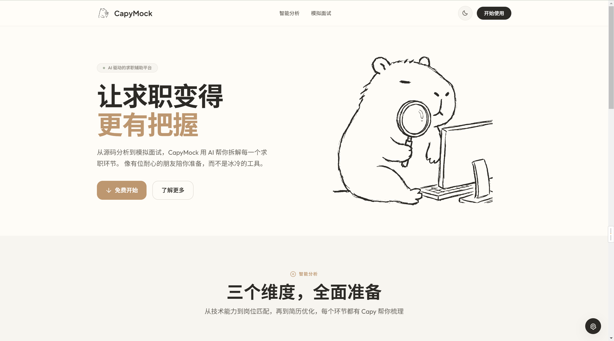
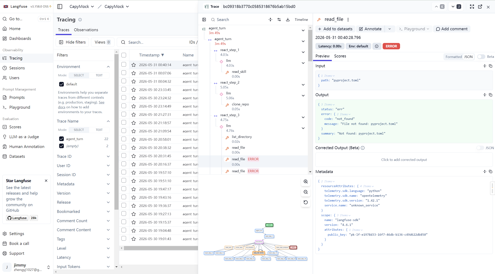

# CapyMock

AI 驱动的求职助手，帮助你温暖而自信地准备面试。



## 简介

CapyMock 是一间面试前的练习室 —— 温暖、包容、不带评判。不同于冷冰冰的企业 HR 平台和令人焦虑的刷题网站，CapyMock 让你按自己的节奏练习，获得真诚的反馈，逐步建立信心。

抽象水豚吉祥物体现了产品气质：沉稳、亲切、不急不躁。

### 功能

- **GitHub 仓库分析** — 分析你的项目经历，为技术面试做准备
- **岗位描述匹配** — 了解你的履历与目标岗位的契合度
- **简历优化** — 针对性地给出简历改进建议
- **模拟面试** — 支持文字和语音两种模式的 AI 模拟面试

## 技术栈

| 层级 | 技术 |
|------|------|
| **前端** | Vue 3 + Vite + Tailwind CSS |
| **后端** | FastAPI + 自研Python ReAct Agent Loop |
| **数据库** | SQLite (aiosqlite) + SQLAlchemy 2.0 |
| **LLM** | DashScope / DeepSeek / MiMo（OpenAI 兼容） |
| **可观测性** | Langfuse（OpenTelemetry SDK v4） |
| **设计系统** | 大地色系（蜂蜜橡木、苔藓绿、珊瑚沙） |
| **字体** | Plus Jakarta Sans + Outfit |

## 快速开始

### 前端

```bash
cd frontend
npm install
npm run dev
```

开发服务器默认运行在 `http://localhost:3000`。

### 后端

```bash
cd backend
uv sync
cp .env.example .env   # 填入 LLM API Key
uv run uvicorn api.app:app --reload
```

API 默认运行在 `http://localhost:8000`。

启用 Langfuse 追踪（可选）：

```bash
# 在 .env 中设置 TRACER=langfuse 并配置 Langfuse 密钥
# 或使用 Docker Compose 启动 Langfuse 服务
docker compose --profile langfuse up -d
```

## 可观测性

后端 Agent 执行过程通过 Langfuse 进行全链路追踪，可查看 ReAct 循环、LLM 调用、工具执行等每一步的输入输出，便于调试与优化。



## 项目结构

```
job-seeker-assistant/
├── frontend/          # Vue 3 前端
│   └── src/
│       ├── components/    # 可复用组件
│       ├── pages/         # 页面视图
│       ├── layouts/       # 页面布局
│       ├── composables/   # 组合式函数
│       ├── stores/        # 状态管理
│       ├── router/        # 路由配置
│       └── api/           # 接口层
├── backend/           # FastAPI 后端
│   ├── agent/             # ReAct Agent Loop
│   ├── api/               # REST / SSE / WebSocket 路由
│   ├── config/            # 配置与 Agent Profile
│   ├── tool/              # 工具系统（clone_repo、read_file 等）
│   ├── trace/             # Langfuse 集成
│   └── tests/             # 测试
├── DESIGN.md          # 设计系统规范
├── PRODUCT.md         # 产品定位和用户画像
└── README.md          # 项目说明
```

后端详细架构与 API 文档见 [backend/README.md](backend/README.md)。

## 设计理念

1. **温暖优先于效率** — 情感舒适是第一位的
2. **支持而非施压** — 鼓励进步，不制造焦虑
3. **人性化而非企业化** — 对话式语气，自然流畅
4. **清晰而不冰冷** — 干净的布局，温暖的色彩与动效

## 项目状态

- [x] 前端初版页面搭建
- [x] 设计系统定义（DESIGN.md）
- [x] 后端 FastAPI + ReAct Agent 架构
- [x] GitHub 仓库分析（异步任务 + 工具链）
- [x] Langfuse 可观测性集成
- [ ] 前端界面优化迭代
- [ ] 模拟面试功能前后端对接
- [ ] 语音面试模式

## License

MIT
